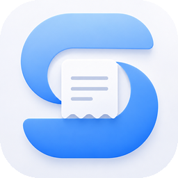

<p align="center">
  
</p>

<h1 align="center">SIMHub 下载</h1>

SIMHub 是一款管理实体 SIM / eSIM 卡的 App（iPhone / iPad / Mac，以及 Android）：接上读卡器就能管理 eSIM 芯片卡里的 Profile，还能让读卡器里的卡直接在手机上用 Wi-Fi 通话收发短信、打接电话。

> **2026-10-07 起 SIMHub 已从 App Store 移除，正在申诉中。** 已经安装的用户可以继续使用，但无法从 App Store 重新下载。这里提供 IPA 安装包，供已有用户换机 / 重装使用。本仓库只放安装包，不含源代码。

## 下载

去 [Releases](../../releases) 页面下载：

| 平台 | 版本 | 文件 | 要求 | 说明 |
|---|---|---|---|---|
| iOS / iPadOS（自签用） | **29.12 (1)** | `SIMHub-29.12-sideload.ipa` | iOS / iPadOS 17.0 及以上 | **用 AltStore / Sideloadly / 轻松签等自签请下这个。** 已去掉小组件、密码自动填充扩展和 iCloud / 推送等受限权限，任何签名工具不用改设置直接签 |
| iOS / iPadOS（完整包） | 29.12 (1) | `esimSubscription.ipa` | iOS / iPadOS 17.0 及以上 | 开发者登记设备直装用；自签需要手动去权限、去扩展 |
| iOS / iPadOS（旧系统） | SIMKit 7.0 (1) | `SIMKit.ipa` | iOS / iPadOS 15.0 及以上 | SIMHub 的 iOS 15 兼容版，见下方「SIMKit」 |
| macOS | 29.11 (1) | `SIMHub-macOS-29.11.zip` | macOS 14 及以上 | 已通过 Apple 公证，见下方「Mac 版」 |
| Android | 0.1.2 (3) | `SIMHub-Android-0.1.2.apk` | Android 8.0 及以上 | 见下方「Android 版」 |

## 怎么安装

自签请下载 **`SIMHub-29.12-sideload.ipa`**，用自己的 Apple ID 重新签名后安装，常用工具：

- [AltStore](https://altstore.io)（Mac / Windows 配合 AltServer）
- [Sideloadly](https://sideloadly.io)（Mac / Windows）
- 其他自签工具（轻松签、牛蛙助手等）

重签时请注意：

1. 免费 Apple ID 签出来的 App **7 天到期**，到期前用同一工具刷新一次即可，数据不会丢；付费开发者账号一年。
2. 自签包里没有 iCloud 同步、推送、小组件和密码自动填充，其他功能（读卡器、eSIM 管理、Wi-Fi 通话、短信、电话、台账）都在。
3. **手机上如果还装着 App Store 下载的 SIMHub，先导出备份再删掉它**，否则会提示无法安装（同一个 App 不能同时存在两种签名）。装好自签版后导入备份即可。
4. 免费 Apple ID 一周内最多签 10 个 App ID、同时最多装 3 个自签 App，超了会安装失败，删掉一个再试。
5. 重签后**一启动就闪退**：说明用的是 29.11 或更早的包，换 29.12。
6. 还是装不上：把签名工具最后的错误提示截图发到 Issues，并写明 iOS 版本和用的工具。

## SIMKit（iOS 15 兼容版）

[下载 SIMKit.ipa](../../releases/tag/simkit-v7.0)

SIMKit 是 SIMHub 的 iOS 15 兼容版，功能与 SIMHub 基本一致，适合还在用 iOS 15 / 16 的 iPhone / iPad。系统是 iOS 17 及以上的，建议直接用上面的 SIMHub。

- **安装**：与 SIMHub 的 IPA 相同，用自己的 Apple ID 重新签名后安装，注意事项见上方「怎么安装」。
- SIMKit 与 SIMHub 是两个独立的 App，可以同时安装，数据不互通；迁移请用 App 内的导出 / 导入备份。

## Mac 版

[下载 SIMHub-macOS-29.11.zip](../../releases/tag/mac-v29.11)

**安装**：下载后双击解压，把 `SIMHub.app` 拖进「应用程序」文件夹，双击打开。App 已通过 Apple 公证，不需要重签，也不会出现「无法验证开发者」的提示。

**说明**：Mac 版支持 USB 读卡器和 4G 模块，也可以作为「Mac 转发」把插在 Mac 上的读卡器 / 模块卡借给 iPhone 使用。

## Android 版

[下载 SIMHub-Android-0.1.2.apk](../../releases/tag/android-v0.1.2)

**安装**：在 Android 手机上下载 APK 后打开，按提示允许浏览器或文件管理器「安装未知应用」即可，不需要重签。

**说明**：

- Android 版的读卡器只支持 **USB（CCID）读卡器**，需要手机支持 USB OTG；暂不支持蓝牙读卡器、4G 模块和 Mac / NAS 转发。
- Wi-Fi 通话、短信、打接电话（系统通话界面）、卡片台账与到期提醒等功能与 iOS 版一致。
- 本 APK 与 Google Play 测试版**签名不同，不能互相覆盖安装**。换渠道前请先在 App 内导出备份，卸载后再安装新的。
- 不支持紧急呼叫；为防诈骗，不支持拨打中国大陆号码（+86）。
- 校验文件：Release 页面写有签名证书和 APK 的 SHA-256。

## 主要功能

- **读卡器 eSIM 管理**：USB（CCID）或蓝牙读卡器，读取 EID / ICCID，启用、停用、删除、下载 Profile；支持 5ber、Xesim、eSTK、9eSIM 等多芯片卡与 SIM PIN。
- **Wi-Fi 通话**：读卡器里的卡直接在手机上收发短信、打接电话（IKEv2 / IPsec、EAP-AKA、IMS），带运营商适配表；电话风格的信息 / 通讯录 / 拨号 / 通话记录。
- **4G 模块**：外接 4G 模块作为卡源。
- **Mac / NAS 转发**：把 Mac 或 NAS 上的读卡器、模块卡经局域网或 Tailscale 借给手机用。
- **卡片台账**：每张卡的订阅、流量、账单与到期提醒，日历集成、小组件；五种语言。

## 数据安全

- 所有数据只存在本机（和你自己的 iCloud），不经过任何第三方服务器。
- 换机或重装前请先在 App 内**导出备份**，重装后再导入（iOS 与 Android 的备份文件互通）。

## 校验

`SIMHub-29.12-sideload.ipa` SHA-256：

```
dd5ee6390081ed171b8ae7769a91e0960a2ec6e6ff974343d810166c4d7a015c
```

`esimSubscription.ipa` (29.12) SHA-256：

```
842369a252088032f9560ac04db3c0439ab0812dbb1519bb2768604a53e08c5b
```

`esimSubscription.ipa` (29.11) SHA-256：

```
7e17d1411c244760e00971e0fb9ddbbfe7a6e8b84577130478e9261ec1b43af4
```

## 反馈

问题和建议请发 [Issues](../../issues)。

## 免责声明

1. **仅供个人学习与研究使用。** 本仓库提供的安装包仅用于学习 SIM / eSIM、读卡器与 Wi-Fi 通话等相关技术，以及管理你本人合法持有的 SIM 卡和 eSIM。请勿用于任何商业用途。
2. **只能用于你本人合法持有、已完成实名登记的号码和卡片。** 不得用于他人的卡片或号码，不得用于盗用、冒用他人身份，不得规避运营商的实名制、计费或其他服务条款。
3. **严禁用于任何违法违规用途**，包括但不限于：电信网络诈骗、冒充他人或机构、骚扰电话与垃圾短信、批量注册或养号、为诈骗等违法活动提供通信帮助（「两卡」相关违法行为）、绕过监管或运营商限制。
4. **防诈骗措施。** 本应用不支持拨打中国大陆号码（+86），也不支持紧急呼叫；不会读取、导出或上传 SIM 卡内的密钥，所有鉴权由 SIM 卡自身完成。请不要尝试修改或绕过这些限制。
5. **请遵守你所在国家 / 地区的法律法规**以及运营商的服务条款。因使用本应用产生的一切后果，包括但不限于号码被运营商停用、费用损失、法律责任等，均由使用者自行承担。
6. **按「现状」提供，不作任何保证。** 开发者不对本应用的可用性、稳定性及适用于特定用途作任何明示或暗示的保证，也不对因使用或无法使用本应用造成的任何直接或间接损失承担责任。
7. **与运营商及厂商无关。** SIMHub 是独立开发的工具，与任何运营商、eSIM 服务商或读卡器厂商均无关联，文中提到的名称和商标归其各自所有者。
8. 如发现有人利用本应用从事诈骗等违法活动，请立即向当地公安机关报案（中国大陆可拨打 110 或反诈专线 96110）。

**下载、安装或使用本应用，即表示你已阅读并同意以上声明。**

### Disclaimer (English)

For **personal learning and research only**. Use it only with SIM cards and numbers that you legally own. Any illegal use — including telecom fraud, impersonation, harassment, spam, bulk registration, or circumventing carrier rules or real-name requirements — is strictly prohibited. The app blocks calls to mainland China numbers (+86), does not support emergency calls, and never reads or exports SIM secret keys. You are solely responsible for complying with local laws and carrier terms. The software is provided "as is" without warranty of any kind, and the developer is not liable for any loss or consequence arising from its use. SIMHub is independent and not affiliated with any carrier, eSIM provider or reader manufacturer.
